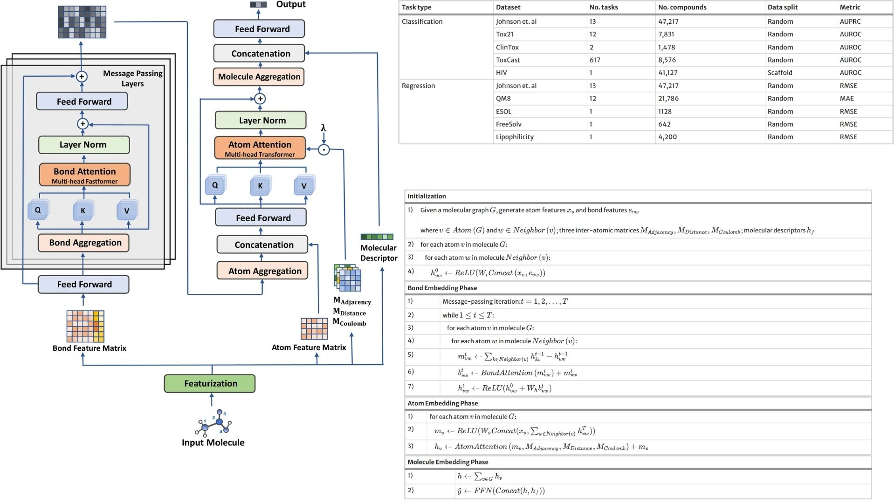

# 🔎 ABT-MPNN-Replication — Atom-Bond Transformer Message Passing Network

This repository provides a **forward-only PyTorch replication** of the  
**Atom-Bond Transformer-based Message Passing Neural Network (ABT-MPNN)**  
for molecular representation modeling.

The objective is **architectural and mathematical fidelity** rather than
benchmark performance. The implementation translates the core formulation —
**bond-aware message passing, transformer-style attention over atoms,
and molecule-level embedding aggregation** — into minimal, readable code
without training pipelines or dataset optimization.

The focus is understanding how:

- Atomic and bond features jointly shape molecular embeddings  
- Inter-atomic descriptors guide attention weighting  
- Transformer attention enhances chemical context propagation ⟡


Paper reference:  [ABT-MPNN: Atom-Bond Transformer-based Message Passing Neural Network for Molecular Property Prediction ](https://link.springer.com/article/10.1186/s13321-023-00698-9?utm_source=chatgpt.com)


---

## Overview — Atom–Bond Interaction Modeling ✦



>Molecular behavior emerges from coupled atomic identity,
>bond connectivity, and spatial/electronic interactions.

ABT-MPNN integrates:

- Bond-aware message passing  
- Transformer attention on atom embeddings  
- Inter-atomic structural descriptors  
  (adjacency, distance, Coulomb matrices)

This produces representations capturing both
**local chemical interactions** and **global molecular context**.

---

## Molecular Graph Representation ⚗︎

A molecule is modeled as:

$$
G = (V, E)
$$

with atom features:

$$
X \in \mathbb{R}^{N \times d_a}
$$

and bond features:

$$
E \in \mathbb{R}^{M \times d_b}
$$

Additional structural descriptors:

$$
M_{adj},\; M_{dist},\; M_{coul}
$$

encode connectivity, geometry, and electrostatic relations.

---

## Bond-Aware Message Passing ⛓

Initial bond-conditioned messages:

$$
m_{vw} = \text{ReLU}\big(W_m [h_v \Vert e_{vw}]\big)
$$

Bond attention refines neighbor importance:

$$
\tilde{m}_{vw} =
\text{BondAttention}(m_{vw}) + m_{vw}
$$

Atom states update as:

$$
h_v^{(t+1)} =
\text{ReLU}\Big(h_v^{(t)} +
\sum_{w\in\mathcal{N}(v)} \tilde{m}_{vw}\Big)
$$

This preserves bond chemistry during propagation.

---

## Atom Transformer Attention ✧

After message passing, atom embeddings undergo
scaled dot-product attention guided by inter-atomic descriptors:

$$
H' =
\text{AtomAttention}(H,
M_{adj}, M_{dist}, M_{coul}) + H
$$

This stage enhances:

- Long-range interaction modeling  
- Structural awareness  
- Global chemical consistency

---

## Molecule Embedding Phase 🜁

Node embeddings aggregate into a molecular vector:

$$
h_G = \text{Readout}(H')
$$

Final prediction head:

$$
\hat{y} =
\text{FFN}\big([h_G \Vert h_{aux}]\big)
$$

This produces a compact representation
for downstream molecular reasoning tasks.

---

## Why This Architecture Matters 🧪

ABT-MPNN highlights:

- Joint atom–bond representation learning  
- Transformer attention in chemical graphs  
- Integration of physics-inspired descriptors  
- Stable graph representation refinement  

It reflects how modern GNNs blend
**graph theory, quantum chemistry intuition,
and attention mechanisms**.

---

## Repository Structure 🗂

```bash
ABT-MPNN-Replication/
├── src/
│
│   ├── mpnn/
│   │   ├── message_functions.py
│   │   ├── bond_attention.py
│   │   ├── atom_attention.py
│   │   ├── readout.py
│   │   └── mpnn_core.py
│
│   ├── chemistry/
│   │   ├── atom_features.py
│   │   ├── bond_features.py
│   │   └── graph_builder.py
│
│   └── config.py
│
├── images/
│   └── figmix.jpg
│
├── requirements.txt
└── README.md
```
---


## 🔗 Feedback

For questions or feedback, contact: [barkin.adiguzel@gmail.com](mailto:barkin.adiguzel@gmail.com)
